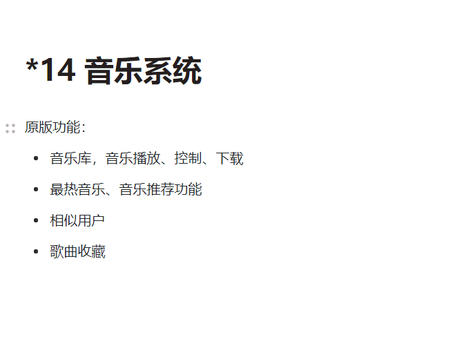
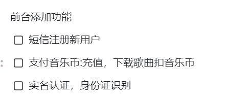
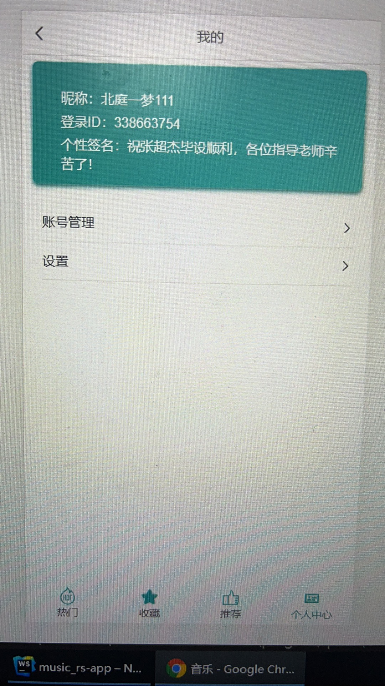

## Python+Spark爬虫音乐推荐系统 音乐爬虫 音乐可视化 音乐推荐系统 大数据毕业设计

## 要求
### 源码1000-2500一套(论文 PPT 源码+sql脚本)，本套系统将在2021年11月底发布，此时将秒杀全网，争做大数据毕业设计第一牛逼人！全中国做大数据毕业设计的商家以我目前调研来看最多个位数，就是这么自信，不懂的话你可以看我B站大数据毕设指导思路就明白了

https://www.bilibili.com/video/BV1UU4y1g7PB?spm_id_from=333.999.0.0

### 白嫖滚蛋！源码收费的！别怨repo主爆粗口只是每天被一群白嫖杂种整神经了
### 加好友前帮忙start一下，并备注github有偿获取源码
### 我的QQ号是2877135669 或者 1679232425
### 加qq好友说明（被部分 s b 网友整得心力交瘁）：
    1.加好友务必按照格式备注
    2.避免浪费各自的时间！
    3.当“客服”不容易，repo 主是体面人，不爆粗，性格好，文明人。上面的 sb 字眼请谅解

## 为啥这么娼？
全网做Python+Spark的爬虫+推荐系统+大屏统计的我们是唯一一家，你要能找到的要么是价格是我5-10倍，要么是坑定金的废物，大数据毕业设计这块我们有足够的信息统治全网这块

## 开发技术
Hadoop、Spark、SparkSQL、Python、MySQL、协同过滤算法、皮尔逊相关系数、KNN、echarts、

阿里云短信接口、支付宝沙箱支付、百度AI身份证自动识别

# 整体架构设计

Java端API接口中台系统

大屏统计端

用户网页端(实时推荐)

管理员网页管理端

用户app移动端(与‘用户网页端’功能一致)

Python爬虫+机器学习离线分析端

# 功能描述

# 运行截图(不定期更新)

PS: 大屏统计端正在开发中(2021年11月底完工)，完成后将[当天立刻!!!]同步上传全部详细图

## 创新点

使用Python爬虫技术爬取网易云音乐数据；

使用机器学习相关的知识(协同过滤算法、皮尔逊相关系数、KNN等)进行离线数据分析，形成离线推荐；

使用短信接口完整前端用户通过手机号修改密码功能；

使用支付宝沙箱支付完成充值功能(付费音乐)；

使用百度AI图像识别接口完成用户认证身份证自动识别功能；

使用apache-echarts+SparkSQL完成数据分析+大屏统计

# 运行视频(B站)

https://www.bilibili.com/video/BV1GT4y1R75n?spm_id_from=333.999.0.0

https://www.bilibili.com/video/BV1qR4y1J7ZK?spm_id_from=333.999.0.0

