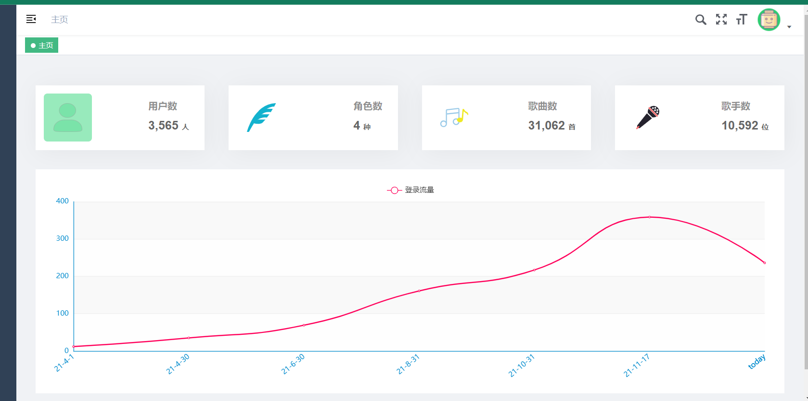

## Python+Spark爬虫音乐推荐系统 音乐爬虫 音乐可视化 音乐推荐系统 大数据毕业设计

## 要求
### 源码有偿！一套(论文 PPT 源码+sql脚本)

https://www.bilibili.com/video/BV1234y1676e?spm_id_from=333.999.0.0

### 
### 加好友前帮忙start一下，并备注github有偿获取源码
### 我的QQ号是2877135669 或者 1679232425
### 加qq好友说明（被部分 网友整得心力交瘁）：
    1.加好友务必按照格式备注
    2.避免浪费各自的时间！
    3.当“客服”不容易，repo 主是体面人，不爆粗，性格好，文明人。

## 开发技术
Hadoop、Spark、SparkSQL、Python、MySQL、协同过滤算法、皮尔逊相关系数、KNN、echarts、

阿里云短信接口、支付宝沙箱支付、百度AI身份证自动识别

# 整体架构设计

Java端API接口中台系统

大屏统计端

用户网页端(实时推荐)

管理员网页管理端

用户app移动端(与‘用户网页端’功能一致)

Python爬虫+机器学习离线分析端

# 功能描述

1、音乐大屏幕展示端：

用户来源分布统计，歌手排行，歌手数量，歌曲数量，用户数量，播放数量，收藏数量，下载数量，充值金额排行，歌曲排行榜，数据统计图，播放量统计图。

 

2、用户PC端功能：

用户注册、短信验证、用户登录、音乐库列表，最热歌曲列表展示，推荐歌曲列表，相似用户列表，收藏列表，金额充值，沙箱支付。

 

3、用户移动端APP/小程序端：

用户注册、短信验证、用户登录、音乐库列表，热门音乐、收藏音乐、推荐音乐，金额充值，沙箱支付。

 

4、Python数据爬虫+机器学习_离线计算端：

Python爬虫+机器学习离线分析数据

 

5、后台管理系统

负责全局所有mysql表的增删查改，有一个好处就是爬虫代码失效了，也可以利用后端上传数据保证系统运行。

 

 

# 开发技术

Hadoop、Spark、SparkSQL、Python、MySQL、协同过滤算法、皮尔逊相关系数、KNN、echarts可视化、阿里云短信接口、支付宝沙箱支付、百度AI身份证自动识别、SpringBoot、Vue.js、MyBatis-Plus 

 

 

# 系统创新点

大屏统计可视化

用户网页端(实时推荐) 、

用户app移动端(与‘用户网页端’功能一致)推荐、

Python爬虫

机器学习离线计算分析

短信接口修改密码或者注册

支付宝沙箱支付(网页、app都实现了)

身份证自动识别认证

# 运行截图

## 创新点

使用Python爬虫技术爬取网易云音乐数据；

使用机器学习相关的知识(协同过滤算法、皮尔逊相关系数、KNN等)进行离线数据分析，形成离线推荐；

使用短信接口完整前端用户通过手机号修改密码功能；

使用支付宝沙箱支付完成充值功能(付费音乐)；

使用百度AI图像识别接口完成用户认证身份证自动识别功能；

使用apache-echarts+SparkSQL完成数据分析+大屏统计

# 运行视频(B站)

https://www.bilibili.com/video/BV1234y1676e?spm_id_from=333.999.0.0

https://www.bilibili.com/video/BV1GT4y1R75n?spm_id_from=333.999.0.0

https://www.bilibili.com/video/BV1qR4y1J7ZK?spm_id_from=333.999.0.0

